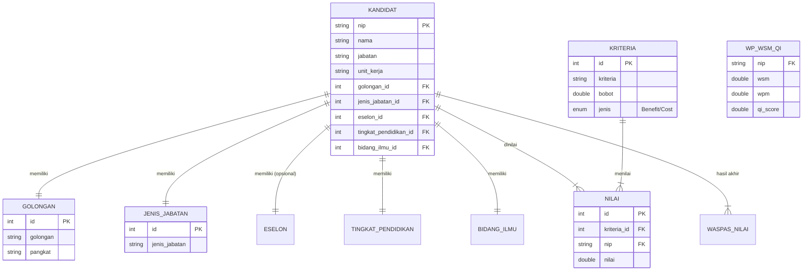

# Laporan Algoritma WASPAS dan Perhitungan Manual

Dokumen ini berisi penjelasan detail mengenai metode Weighted Aggregated Sum Product Assessment (WASPAS) yang diimplementasikan dalam aplikasi Sistem Pendukung Keputusan (SPK), beserta Entity Relationship Diagram (ERD) dan contoh perhitungan manual.

## 1. Entity Relationship Diagram (ERD)

Berikut adalah relasi antar tabel dalam database aplikasi SPK WASPAS:

## 2. Penjelasan Algoritma WASPAS

Metode WASPAS merupakan kombinasi dari dua metode, yaitu *Weighted Sum Model* (WSM) dan *Weighted Product Model* (WPM). Metode ini digunakan untuk mencari alternatif terbaik dari sejumlah alternatif berdasarkan kriteria tertentu.

### Tahap 1: Pembuatan Matriks Keputusan ($X$)
Matriks keputusan $X$ dibentuk dari nilai kinerja setiap alternatif ($A_i$) terhadap setiap kriteria ($C_j$).

$$
X = \begin{bmatrix}
x_{11} & x_{12} & \dots & x_{1n} \\
x_{21} & x_{22} & \dots & x_{2n} \\
\vdots & \vdots & \ddots & \vdots \\
x_{m1} & x_{m2} & \dots & x_{mn}
\end{bmatrix}
$$

Dimana:
*   $m$ = jumlah alternatif (kandidat)
*   $n$ = jumlah kriteria
*   $x_{ij}$ = nilai kinerja calon ke-$i$ pada kriteria ke-$j$

### Tahap 2: Normalisasi Matriks ($R$)
Normalisasi dilakukan untuk menyamakan satuan skala setiap kriteria. Rumus normalisasi bergantung pada jenis kriteria (**Benefit** atau **Cost**).

1.  **Untuk Kriteria Benefit (Keuntungan):**
    Semakin besar nilainya semakin baik.
    $$
    r_{ij} = \frac{x_{ij}}{\max_i(x_{ij})}
    $$
    Dimana $\max_i(x_{ij})$ adalah nilai terbesar pada kriteria $j$.

2.  **Untuk Kriteria Cost (Biaya):**
    Semakin kecil nilainya semakin baik.
    $$
    r_{ij} = \frac{\min_i(x_{ij})}{x_{ij}}
    $$
    Dimana $\min_i(x_{ij})$ adalah nilai terkecil pada kriteria $j$.

### Tahap 3: Perhitungan Nilai WSM ($Q_1$)
*Weighted Sum Model* menghitung skor dengan menjumlahkan perkalian nilai ternormalisasi dengan bobot kriteria.

$$
Q_1^{(i)} = \sum_{j=1}^{n} (r_{ij} \times w_j)
$$

Dimana $w_j$ adalah bobot dari kriteria ke-$j$.

### Tahap 4: Perhitungan Nilai WPM ($Q_2$)
*Weighted Product Model* menghitung skor dengan mengalikan nilai ternormalisasi yang dipangkatkan dengan bobot kriteria.

$$
Q_2^{(i)} = \prod_{j=1}^{n} (r_{ij})^{w_j}
$$

### Tahap 5: Perhitungan Nilai Akhir ($Qi$)
Nilai preferensi akhir ($Qi$) dihitung dengan menggabungkan WSM dan WPM menggunakan faktor $\lambda$ (biasanya $\lambda = 0.5$).

$$
Qi^{(i)} = \lambda \sum_{j=1}^{n} (r_{ij} \times w_j) + (1 - \lambda) \prod_{j=1}^{n} (r_{ij})^{w_j}
$$

Atau lebih sederhananya:
$$
Qi^{(i)} = 0.5 \times Q_1^{(i)} + 0.5 \times Q_2^{(i)}
$$

Alternatif dengan nilai $Qi$ terbesar adalah yang terbaik.

---

## 3. Contoh Perhitungan Manual

Misalkan terdapat 3 Kandidat dan 3 Kriteria.
*   **Bobot Kriteria:**
    *   C1: 0.3 (Benefit)
    *   C2: 0.2 (Cost)
    *   C3: 0.5 (Benefit)

### A. Data Awal (Matriks X)
| Kandidat | C1 (Nilai) | C2 (Jarak) | C3 (Tes) |
| :--- | :---: | :---: | :---: |
| **A1** | 80 | 10 | 90 |
| **A2** | 70 | 20 | 85 |
| **A3** | 90 | 5 | 80 |

### B. Normalisasi Matriks (R)

*   **Kriteria C1 (Benefit)**: Max = 90
    *   $r_{11} = 80/90 = 0.889$
    *   $r_{21} = 70/90 = 0.778$
    *   $r_{31} = 90/90 = 1.000$

*   **Kriteria C2 (Cost)**: Min = 5
    *   $r_{12} = 5/10 = 0.500$
    *   $r_{22} = 5/20 = 0.250$
    *   $r_{32} = 5/5 = 1.000$

*   **Kriteria C3 (Benefit)**: Max = 90
    *   $r_{13} = 90/90 = 1.000$
    *   $r_{23} = 85/90 = 0.944$
    *   $r_{33} = 80/90 = 0.889$

**Matriks Ternormalisasi (R):**
| Alt | C1 | C2 | C3 |
| :--- | :---: | :---: | :---: |
| **A1** | 0.889 | 0.500 | 1.000 |
| **A2** | 0.778 | 0.250 | 0.944 |
| **A3** | 1.000 | 1.000 | 0.889 |

### C. Hitung WSM ($Q_1$)
Rumus: $\sum (r_{ij} \times w_j)$
*   **A1**: $(0.889 \times 0.3) + (0.500 \times 0.2) + (1.000 \times 0.5) = 0.267 + 0.100 + 0.500 = \mathbf{0.867}$
*   **A2**: $(0.778 \times 0.3) + (0.250 \times 0.2) + (0.944 \times 0.5) = 0.233 + 0.050 + 0.472 = \mathbf{0.755}$
*   **A3**: $(1.000 \times 0.3) + (1.000 \times 0.2) + (0.889 \times 0.5) = 0.300 + 0.200 + 0.444 = \mathbf{0.944}$

### D. Hitung WPM ($Q_2$)
Rumus: $\prod (r_{ij})^{w_j}$
*   **A1**: $(0.889)^{0.3} \times (0.500)^{0.2} \times (1.000)^{0.5} = 0.965 \times 0.871 \times 1.000 = \mathbf{0.841}$
*   **A2**: $(0.778)^{0.3} \times (0.250)^{0.2} \times (0.944)^{0.5} = 0.927 \times 0.758 \times 0.972 = \mathbf{0.683}$
*   **A3**: $(1.000)^{0.3} \times (1.000)^{0.2} \times (0.889)^{0.5} = 1.000 \times 1.000 \times 0.943 = \mathbf{0.943}$

### E. Nilai Akhir ($Qi$)
Rumus: $0.5 \times Q_1 + 0.5 \times Q_2$
*   **A1**: $0.5(0.867) + 0.5(0.841) = 0.4335 + 0.4205 = \mathbf{0.854}$
*   **A2**: $0.5(0.755) + 0.5(0.683) = 0.3775 + 0.3415 = \mathbf{0.719}$
*   **A3**: $0.5(0.944) + 0.5(0.943) = 0.4720 + 0.4715 = \mathbf{0.944}$

### F. Perankingan
1.  **A3** (Nilai: 0.944) - **Peringkat 1**
2.  **A1** (Nilai: 0.854) - **Peringkat 2**
3.  **A2** (Nilai: 0.719) - **Peringkat 3**
